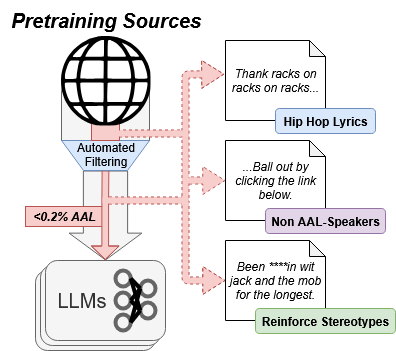

# Data Caricatures (Code upload in progress)
Code accompanying [Data Caricatures: On the Representation of African American Language in Pretraining Corpora](https://aclanthology.org/2025.acl-long.1416/), Deas et al., 2025 presented at the 63rd Annual Meeting of the Association for Computational Linguistics.

<p align="center">
  
</p>

# Setup
  1. Clone the repository
  2. Create a virtual environment and install all dependencies:
     ```
     pip install -r requirements.txt
     ```
  3. Run setup.sh to download the necessary data, models, and other resources.
   
# Extracting AAL Subsets

  _Analysis based in part on modified code and models released in [Demographic Dialectal Variation in Social Media: A Case Study of African-American English](https://aclanthology.org/D16-1120/) (Blodgett et al., EMNLP 2016)_

# Feature Analysis

_Analysis based in part on modified code and models released in [Corpus-Guided Contrast Sets for Morphosyntactic Feature Detection in Low-Resource English Varieties](https://aclanthology.org/2022.fieldmatters-1.2/) (Masis et al., FieldMatters 2022)._

# Hip Hop Overlap Analyses

# Filtering Experiments

# Citation

```
@inproceedings{deas-etal-2025-data,
    title = "Data Caricatures: On the Representation of {A}frican {A}merican Language in Pretraining Corpora",
    author = "Deas, Nicholas  and
      Vente, Blake  and
      Ananthram, Amith  and
      Grieser, Jessica A  and
      Patton, Desmond U.  and
      Kleiner, Shana  and
      Iii, James R. Shepard  and
      McKeown, Kathleen",
    editor = "Che, Wanxiang  and
      Nabende, Joyce  and
      Shutova, Ekaterina  and
      Pilehvar, Mohammad Taher",
    booktitle = "Proceedings of the 63rd Annual Meeting of the Association for Computational Linguistics (Volume 1: Long Papers)",
    month = jul,
    year = "2025",
    address = "Vienna, Austria",
    publisher = "Association for Computational Linguistics",
    url = "https://aclanthology.org/2025.acl-long.1416/",
    pages = "29192--29217",
    ISBN = "979-8-89176-251-0",
}
```

# Data Requests/Contact
  For any questions, please contact [ndeas@cs.columbia.edu](mailto:ndeas@cs.columbia.edu).
  
  **To request the extracted AAL subsets from each corpus or the human judgment results,** please reach out to us via email with an description of your intended use case.
